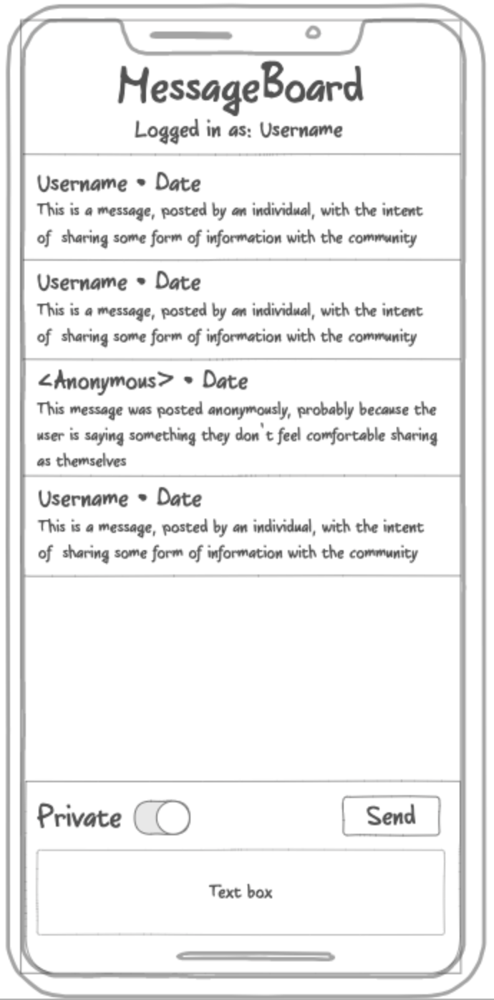

# CS260 Startup Project
A CS 260 Web Development Project

## Git Notes
- Git is a powerful tool for version management
- Ensure that local repository is up to date before continuing working

## Startup Proposal
Have you ever wanted a place to voice your mind? Have you ever needed a place to share your thoughts that you can't share anyone else?  Have you ever wanted a simple place to talk to your friends?  If so, then this message board is the place for you!  With a simple interface and support for both indentifiable and private conversing, this message board is the perfect place to voice your mind without the complexities or worries of traditional chat platforms. Simply make an account and send a message!

